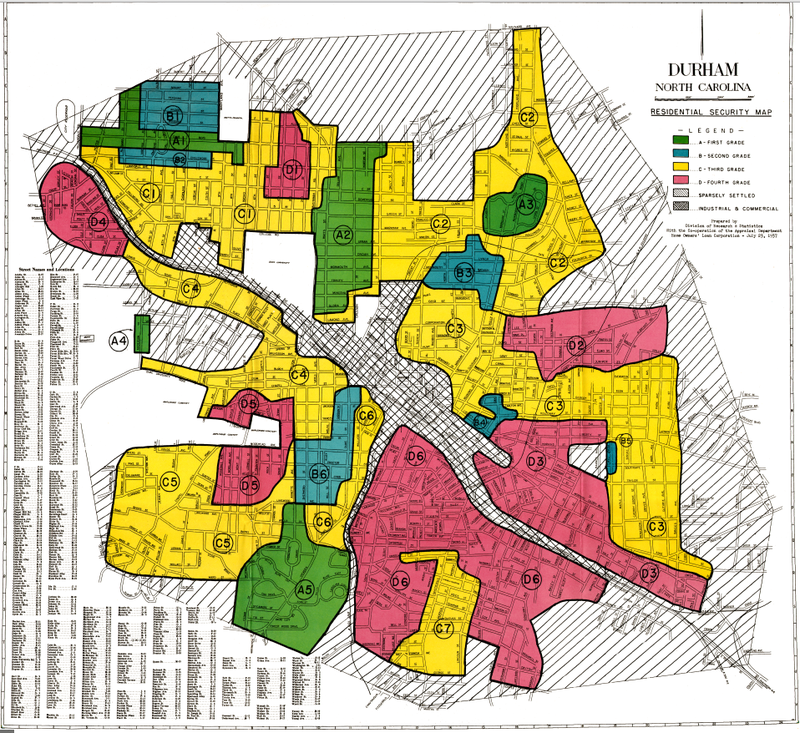

```{r set-options, echo=FALSE, cache=FALSE}
options(width = 1200)
```


```{r setup, include=FALSE}
knitr::opts_chunk$set(echo = TRUE)
library(dplyr)
library(ggplot2)
library(stringr)
library(readr)
library(highcharter)
library(jsonlite)
library(geojson)
library(tibble)
library(htmlwidgets)
library(codefolder)
```


### Introduction 

R has many packages for creating interactive data visualizations. One of my favorites is the Highcharter package, which provides an API to Highcharts, an excellent Javascript data visualization platform. In this tutorial, I demonstrate the utility of Highcharter for creating multilevel maps: maps that you can click on to drill down into additional data visualizations. I will be working with redlining data. 

Redlining was the federal government's practice of assigning color codes to neighborhoods. These colors were used to inform mortgage underwriting standards from the 1930s to the 1970s. White households were more likely be located in green and blue (higher rated) neighborhoods, while black households were typically found in yellow and red (lower rated) neighborhoods. As a result, these mortgage underwriting practices contributed to the large wealth disparity between black and white families that persists today.

Geographic data on redlining in Durham is available online at [tim-maps.carto.com/tables/durhamredliningzones/public](https://tim-maps.carto.com/tables/durhamredliningzones/public). This data is based on a 1937 zoning map from Home Owners Loan Corporation, pictured below.

{#id .class width=90% height=90%}
\

### Preparing Geographic and Census Data 

First, I'll load the data into the R environment, using the readOGR function from the rgdal package. This  is a shapefile contained in the durhamredliningzones folder on my harddrive. The name of this shapefile is durhamredliningzones.shp, which is the second argument of the function. I store this data in the R environement as an object called durham_redline_shp. 

```{r}
# Get shapefile of redlining by Durham zones 
durham_redline_shp <- rgdal::readOGR("~/Downloads/durhamredliningzones", 
                                     "durhamredliningzones")
```

Next, I perform several operations on this shapefile. I attach an id variable ("id") to the shapefile, convert it into a tibble containing the geographic information in the shapefile, use the left_join function to merge the shapefile data into the tibble containing geographic information, and alter the "label" variable so it contains only the first character of the original string (e.g. "A" instead of "A4").   

```{r}
# Merging in id var
durham_redline_shp@data$id <- rownames(durham_redline_shp@data)

# Turning shapefile into dataframe 
durham_redline_tbl <- fortify(durham_redline_shp) %>% as_tibble

# Merging shapefile data into tbl 
durham_redline_tbl <- left_join(durham_redline_tbl, durham_redline_shp@data, "id") 

# limiting to color-coded areas
durham_redline_tbl2 <- durham_redline_tbl %>% mutate(label = str_sub(label, 1, 1))

# Making id numeric 
durham_redline_tbl2 <- durham_redline_tbl2 %>% mutate(id = as.numeric(id))
```

My goal here is to make a map that resembles the HOLC map shown above and that you can click on to view how the distribution of black and white households has changed in each zone over time. To do this, I use data from the 1970, 1980, 1990, 2000, and 2010 decennial censuses. These data are publicly available and I downloaded them from IPUMS National Historical GIS website ([https://www.nhgis.org/](https://www.nhgis.org/)). One issue with using Census data to estimate race distributions of redlined zones is that the Census does not aggregate their data to the level of zones given in the redlining data. Instead, neighborhood information in contained in Census tracts. My way of getting around this issue is to use to the gIntersection function from the rgeos package to determine the area of overlap between each zone and overlapping Census tracts. Then, tract populations were distributed across the zones based on the areas associated with these overlaps. This technique isn't perfect because it assumes uniform population density over these regions, but it is sufficient for our purposes. I won't show the code for producing the underlying race data, but you can find it [here](https://github.com/AndrewCarr24/redlining/blob/master/redline_race_merge.R) and [here](https://github.com/AndrewCarr24/redlining/blob/master/zone_tract_matching.R).

```{r, echo = FALSE, include = FALSE}
# Script that merges Census data into redlining tbl  
source("~/redlining_project/redline_race_merge.R")
```

I now have two objects - a shapefile with the redlining data, and a tibble that has geographic coordinates and data associated with each shape. This also has race information based on the Census. Let's have a look at the relevant columns from this tibble. This tibble is 1269 rows. Each row represents a pair of geographic coordinates in one of the shapes associated with the redlining data. Shapes are indexed by the id variable, which starts at 0. The name column gives the zone name, and the label columns gives the zone color code. Finally the white_prop_[year] and black_prop_[year] columns provide race proportions for each zone in a given year.

```{r}
durham_redline_tbl2 %>% select(long, lat, id, name, label,
                               white_prop_1970, black_prop_1970, 
                               white_prop_1980, black_prop_1980,
                               white_prop_1990, black_prop_1990, 
                               white_prop_2000, black_prop_2000,
                               white_prop_2010, black_prop_2010)
```

### Creating Drilldown Files 

Next, I format the data to make it compatible with Highcharts. To create maps, Highcharts uses data in geojson format. However, Highcharter (the R API for Highcharts) requires an R object (a nested list) based on a JSON file. Long story short: we need to convert our shapefile into a geojson file and then convert this into an R object. I use the as.geojson function from the geojson package to convert durham_redline_shp into a geojson object and fromJSON from the jsonlite package to convert this into a nested list.  

```{r}
# Converting to geojson
durham_redline_json <- as.geojson(durham_redline_shp) %>% 
  fromJSON(., simplifyVector = FALSE)
```

Creating a Highcharts map that drills down into other visualizations requires assigning an id variable to each shape in durham_redline_json. This nested list stores shapes in "features", each of which is itself a list containing a "properties" list where a matching id can be stored. For each shape (feature), I create a NAME variable and assign to this a zone id (e.g. "zone12").    

```{r}
zone_idx <- durham_redline_tbl2 %>%
  filter(label %in% c("A", "B", "C", "D")) %>% .[["id"]] %>% unique + 1 

# Adding id to json
count <- 1 
for(i in zone_idx){
  durham_redline_json$features[[i]]$properties$NAME <- paste0("zone", count)
  count <- count + 1 
}
```

Next, I create two vectors, one of the colors associated with each zone and another of the name associated with each zone. 

```{r}
# Creating color string
colors_str <- durham_redline_tbl2 %>% 
  filter(label %in% c("A", "B", "C", "D")) %>%
  filter(!duplicated(id)) %>% 
  mutate(color_rgb = ifelse(label == "A", "#31ad71", 
                            ifelse(label == "B", "#719cd9", 
                                   ifelse(label == "C", "#ffe482", "#fc6658")))) %>% 
  .[["color_rgb"]]

# Creating color string
names_str <- durham_redline_tbl2 %>% 
  filter(label %in% c("A", "B", "C", "D")) %>% 
  filter(!duplicated(id)) %>% .[["name"]]
```

Finally, I convert durham_redline_tbl2 from wide to long format and make some other last modifications. 

```{r}
# Converting durham_redline_tbl2 from wide to lng 
durham_redline_tbl2 <- durham_redline_tbl2 %>% 
  filter(!duplicated(name)) %>% 
  filter(label %in% c("A", "B", "C", "D")) %>% 
  select(id, name, white_prop_1970, 
         white_prop_1980, white_prop_1990,
         white_prop_2000, white_prop_2010, 
         black_prop_1970, black_prop_1980, 
         black_prop_1990, black_prop_2000, 
         black_prop_2010)

durham_redline_tbl_lng <- bind_rows(
  durham_redline_tbl2 %>% select(id, name, white_prop_1970) %>% 
    rename(y = white_prop_1970) %>% add_column(x = "white_1970"), 
  durham_redline_tbl2 %>% select(id, name, white_prop_1980) %>%
    rename(y = white_prop_1980) %>% add_column(x = "white_1980"), 
  durham_redline_tbl2 %>% select(id, name, white_prop_1990) %>%
    rename(y = white_prop_1990) %>% add_column(x = "white_1990"), 
  durham_redline_tbl2 %>% select(id, name, white_prop_2000) %>%
    rename(y = white_prop_2000) %>% add_column(x = "white_2000"), 
  durham_redline_tbl2 %>% select(id, name, white_prop_2010) %>%
    rename(y = white_prop_2010) %>% add_column(x = "white_2010"),
  durham_redline_tbl2 %>% select(id, name, black_prop_1970) %>%
    rename(y = black_prop_1970) %>% add_column(x = "black_1970"), 
  durham_redline_tbl2 %>% select(id, name, black_prop_1980) %>%
    rename(y = black_prop_1980) %>% add_column(x = "black_1980"), 
  durham_redline_tbl2 %>% select(id, name, black_prop_1990) %>%
    rename(y = black_prop_1990) %>% add_column(x = "black_1990"), 
  durham_redline_tbl2 %>% select(id, name, black_prop_2000) %>%
    rename(y = black_prop_2000) %>% add_column(x = "black_2000"), 
  durham_redline_tbl2 %>% select(id, name, black_prop_2010) %>%
    rename(y = black_prop_2010) %>% add_column(x = "black_2010")
)

durham_redline_tbl_lng <- durham_redline_tbl_lng %>% 
  mutate(race = str_replace(x, "_.*?$", "") %>% trimws) %>% 
  mutate(x = str_extract(x, "_.*?$") %>% str_replace("_", "") %>% as.numeric) %>% 
  select(id, name, x, y, race)
```

Let's see how the resulting tibble looks.

```{r}
durham_redline_tbl_lng
```

Geographic information is missing from this tibble. This has been moved to the json object, durham_redline_json. This tibble is 240 rows, 10 rows for each of the 24 shapes. For each shape, a separate row provides information for the race and year (2 races times 5 years = 10 rows).  

The last thing we need to do is create the drilldown plots. This requires converting the tibble containing race data into a format that Highcharts can understand. Highcharts is written in Javascript, so the drilldown charts have to be Javascript files. I don't code in Javascript, but I've learned enough to create multilevel plots with Highcharts in R. Here's the code for rendering the data we need. 

```{r, include = FALSE}
# Getting JS 
source("~/redlining_project/redline_highcharts_js2.R")
```


```{r, eval=FALSE}

# Creating json data string
drilldown_data_lst <- list()
for(j in durham_redline_tbl_lng$name[1:24]){
  
  for(r in c("white", "black")){
    
    datums <- list() 
    tbl <- durham_redline_tbl_lng %>%
      filter(name == j & race == r)
    
    for(i in 1:nrow(tbl)){
      
      x_tooltip <- tbl %>% pull(x) %>% .[i]
      x <- x_tooltip
      
      y <- tbl %>% pull(y) %>% .[i]
      y_tooltip <- str_replace(as.character(y), " ", ",")
      y_rnd <- round(y, 3)
      
      name <- tbl %>% pull(name) %>% .[i]
      name <- str_replace_all(name, "'", "\\\\'")
      
      datums[[i]] <- paste0("{","name:", "'", name, "'", ",", "x:",
                            x, ",", "x_tooltip:", x_tooltip, ",",
                            "y:", y, ",", "y_tooltip:", y_tooltip, ",",
                            "y_rnd:", y_rnd, "}")
      
    }
    
    drilldown_data_lst[[(length(drilldown_data_lst)+1)]] <- paste(datums %>% 
                                                                    unlist, collapse = ",")
  }
}


################
# Drilldown JS #
################

# Start of JS file 
js_start <- "function(e) {
if (!e.seriesOptions) {
var chart = this,
drilldowns = {"

# End of JS file 
js_end <- "
}

series = [drilldowns[e.point.drilldownName]];

var str = e.point.name

series = [drilldowns[e.point.drilldownName], drilldowns[e.point.drilldownName + '2']];

chart.addSingleSeriesAsDrilldown(e.point, series[0]);
chart.addSingleSeriesAsDrilldown(e.point, series[1]);
chart.applyDrilldown();
}

chart.title.update({
text: 'Proportion Black and White Households 1970-2010'
})

}"

## Drilldown plot properties 

# Color string
colors_str_mod <- rep(c("#DDA77B", "#37123C"), 24)

# Names string
names_str_mod <- paste0(str_sub(names_str, 1, 1), "_", str_extract(names_str, "[0-9]+"))
names_str_mod <- paste0(rep(names_str_mod, each = 2), c("", "2"))

# Race str
race_str <- rep(c("White", "Black"), 24)

# Zone str
zone_str <- rep(paste0("zone", 1:24), each = 2)

# Creating drilldown body
drilldown_json <- paste0("
'", names_str_mod, "': {
name: '", race_str, "',
color: '", colors_str_mod, "',
tooltip: {headerFormat: '', pointFormat: '<b>Prop:</b> {point.y_rnd} <br><b>Year:</b> {point.x}'},
type: 'line',
marker: {enabled: true, symbol: 'circle', radius: 3},
drilldownName: '", zone_str, "',
data: [",
drilldown_data_lst
,"]
}")

# Drilldown final
zone_js <- paste0(js_start, paste(drilldown_json, collapse = ","), js_end)

##############
# Drillup JS #
##############

zone_js2 <- "function(e) {

var chart = this;

chart.title.update({
text: 'Redlining in Durham'
})

                  }"

```

This script creates two JS files, zone_js and zone_js2. Creating these files is not as complicated as it looks. The drilldown script consists of three parts: a start to the drilldown function (js_start), the json data (drilldown_json), and the end of the function (js_end). The json data was created by looping through the relevant rows of durham_redline_tbl_lng and putting them into a json format. Each iteration of this loop corresponds to a data series, which is matched to the appropriate shape (via the NAME property in durham_redline_json). To read these as javascript files in R, they can be called inside the JS function from the htmlwidgets package.

### Creating Interactive Plot 

Finally, we're ready to create the interactive plot. First, I modify the drillup button so that it says "Return to map" 

```{r}
# Highcharts global options 
hcoptslang <- getOption("highcharter.lang")
hcoptslang$drillUpText <- "Return to map"
options(highcharter.lang = hcoptslang)
```

In the code below, I chain together several functions from Highcharter. "hc_chart" defines chart parameters. I enter the JS files in this function.  

Next, to create a Highcharts map that allows you to drill down into separate plots for each shape, a separate data series needs to be defined for each shape. This is accomplished through the "hc_add_series" function. Specifically, 24 series are chained together with 24 instances of the "hc_add_series" function. Lastly, the chart title is defined with the "hc_title" function.   


```{r, echo = FALSE}
##############
#### Plot ####
##############

highchart() %>% 
  hc_chart(events = list(
             drilldown = JS(zone_js), 
             drillup = JS(zone_js2))) %>% 
  hc_add_series(name = names_str[1], 
                data = list(list(drilldown = TRUE, drilldownName = "A_4", 
                                 NAME = "zone1")),
                joinBy = "NAME", 
                borderColor = "#c7c3c3",
                color = colors_str[1], 
                mapData = list(x=1,type = "FeatureCollection", 
                               features = durham_redline_json$features[zone_idx[1]]),
                type = "map", geojson = TRUE, 
                showInLegend = FALSE,  tooltip = list(pointFormat = "")) %>% 
  hc_add_series(name = names_str[2], 
                data = list(list(drilldown = TRUE, drilldownName = "D_5", 
                                 NAME = "zone2")),
                joinBy = "NAME", 
                borderColor = "#c7c3c3",
                color = colors_str[2], 
                mapData = list(x = 1, type = "FeatureCollection", 
                               features = durham_redline_json$features[zone_idx[2]]),
                type = "map", geojson = TRUE, 
                showInLegend = FALSE,  tooltip = list(pointFormat = "")) %>% 
  hc_add_series(name = names_str[3], 
                data = list(list(drilldown = TRUE, drilldownName = "C_1", 
                                 NAME = "zone3")),
                joinBy = "NAME", 
                borderColor = "#c7c3c3",
                color = colors_str[3], 
                mapData = list(x = 1, type = "FeatureCollection", 
                               features = durham_redline_json$features[zone_idx[3]]),
                type = "map", geojson = TRUE, 
                showInLegend = FALSE,  tooltip = list(pointFormat = "")) %>% 
  hc_add_series(name = names_str[4], 
                data = list(list(drilldown = TRUE, drilldownName = "A_1", 
                                 NAME = "zone4")),
                joinBy = "NAME", 
                borderColor = "#c7c3c3",
                color = colors_str[4], 
                mapData = list(x = 1, type = "FeatureCollection", 
                               features = durham_redline_json$features[zone_idx[4]]),
                type = "map", geojson = TRUE, 
                showInLegend = FALSE,  tooltip = list(pointFormat = "")) %>% 
  hc_add_series(name = names_str[5], 
                data = list(list(drilldown = TRUE, drilldownName = "A_2", 
                                 NAME = "zone5")),
                joinBy = "NAME", 
                borderColor = "#c7c3c3",
                color = colors_str[5], 
                mapData = list(x = 1, type = "FeatureCollection", 
                               features = durham_redline_json$features[zone_idx[5]]),
                type = "map", geojson = TRUE, 
                showInLegend = FALSE,  tooltip = list(pointFormat = "")) %>% 
  hc_add_series(name = names_str[6], 
                data = list(list(drilldown = TRUE, drilldownName = "A_3", 
                                 NAME = "zone6")),
                joinBy = "NAME", 
                borderColor = "#c7c3c3",
                color = colors_str[6], 
                mapData = list(x = 1, type = "FeatureCollection", 
                               features = durham_redline_json$features[zone_idx[6]]),
                type = "map", geojson = TRUE, 
                showInLegend = FALSE,  tooltip = list(pointFormat = "")) %>% 
  hc_add_series(name = names_str[7], 
                data = list(list(drilldown = TRUE, drilldownName = "A_5", 
                                 NAME = "zone7")),
                joinBy = "NAME", 
                borderColor = "#c7c3c3",
                color = colors_str[7], 
                mapData = list(x = 1, type = "FeatureCollection", 
                               features = durham_redline_json$features[zone_idx[7]]),
                type = "map", geojson = TRUE, 
                showInLegend = FALSE,  tooltip = list(pointFormat = "")) %>% 
  hc_add_series(name = names_str[8], 
                data = list(list(drilldown = TRUE, drilldownName = "B_1", 
                                 NAME = "zone8")),
                joinBy = "NAME", 
                borderColor = "#c7c3c3",
                color = colors_str[8], 
                mapData = list(x = 1, type = "FeatureCollection", 
                               features = durham_redline_json$features[zone_idx[8]]),
                type = "map", geojson = TRUE, 
                showInLegend = FALSE,  tooltip = list(pointFormat = "")) %>%
  hc_add_series(name = names_str[9], 
                data = list(list(drilldown = TRUE, drilldownName = "B_2", 
                                 NAME = "zone9")),
                joinBy = "NAME", 
                borderColor = "#c7c3c3",
                color = colors_str[9], 
                mapData = list(x = 1, type = "FeatureCollection", 
                               features = durham_redline_json$features[zone_idx[9]]),
                type = "map", geojson = TRUE, 
                showInLegend = FALSE,  tooltip = list(pointFormat = "")) %>% 
  hc_add_series(name = names_str[10], 
                data = list(list(drilldown = TRUE, drilldownName = "B_3", 
                                 NAME = "zone10")),
                joinBy = "NAME", 
                borderColor = "#c7c3c3",
                color = colors_str[10], 
                mapData = list(x = 1, type = "FeatureCollection", 
                               features = durham_redline_json$features[zone_idx[10]]),
                type = "map", geojson = TRUE, 
                showInLegend = FALSE,  tooltip = list(pointFormat = "")) %>%
  hc_add_series(name = names_str[11], 
                data = list(list(drilldown = TRUE, drilldownName = "B_4", 
                                 NAME = "zone11")),
                joinBy = "NAME", 
                borderColor = "#c7c3c3",
                color = colors_str[11], 
                mapData = list(x = 1, type = "FeatureCollection", 
                               features = durham_redline_json$features[zone_idx[11]]),
                type = "map", geojson = TRUE, 
                showInLegend = FALSE,  tooltip = list(pointFormat = "")) %>%
  hc_add_series(name = names_str[12], 
                data = list(list(drilldown = TRUE, drilldownName = "B_5", 
                                 NAME = "zone12")),
                joinBy = "NAME", 
                borderColor = "#c7c3c3",
                color = colors_str[12], 
                mapData = list(x = 1, type = "FeatureCollection", 
                               features = durham_redline_json$features[zone_idx[12]]),
                type = "map", geojson = TRUE, 
                showInLegend = FALSE,  tooltip = list(pointFormat = "")) %>%
  hc_add_series(name = names_str[13], 
                data = list(list(drilldown = TRUE, drilldownName = "B_6", 
                                 NAME = "zone13")),
                joinBy = "NAME", 
                borderColor = "#c7c3c3",
                color = colors_str[13], 
                mapData = list(x = 1, type = "FeatureCollection", 
                               features = durham_redline_json$features[zone_idx[13]]),
                type = "map", geojson = TRUE, 
                showInLegend = FALSE,  tooltip = list(pointFormat = "")) %>%
  hc_add_series(name = names_str[14], 
                data = list(list(drilldown = TRUE, drilldownName = "C_2", 
                                 NAME = "zone14")),
                joinBy = "NAME", 
                borderColor = "#c7c3c3",
                color = colors_str[14], 
                mapData = list(x = 1, type = "FeatureCollection", 
                               features = durham_redline_json$features[zone_idx[14]]),
                type = "map", geojson = TRUE, 
                showInLegend = FALSE,  tooltip = list(pointFormat = "")) %>%
  hc_add_series(name = names_str[15], 
                data = list(list(drilldown = TRUE, drilldownName = "C_3", 
                                 NAME = "zone15")),
                joinBy = "NAME", 
                borderColor = "#c7c3c3",
                color = colors_str[15], 
                mapData = list(x = 1, type = "FeatureCollection", 
                               features = durham_redline_json$features[zone_idx[15]]),
                type = "map", geojson = TRUE, 
                showInLegend = FALSE,  tooltip = list(pointFormat = "")) %>%
  hc_add_series(name = names_str[16], 
                data = list(list(drilldown = TRUE, drilldownName = "C_4", 
                                 NAME = "zone16")),
                joinBy = "NAME", 
                borderColor = "#c7c3c3",
                color = colors_str[16], 
                mapData = list(x = 1, type = "FeatureCollection", 
                               features = durham_redline_json$features[zone_idx[16]]),
                type = "map", geojson = TRUE, 
                showInLegend = FALSE,  tooltip = list(pointFormat = "")) %>%
  hc_add_series(name = names_str[17], 
                data = list(list(drilldown = TRUE, drilldownName = "C_5", 
                                 NAME = "zone17")),
                joinBy = "NAME", 
                borderColor = "#c7c3c3",
                color = colors_str[17], 
                mapData = list(x = 1, type = "FeatureCollection", 
                               features = durham_redline_json$features[zone_idx[17]]),
                type = "map", geojson = TRUE, 
                showInLegend = FALSE,  tooltip = list(pointFormat = "")) %>%
  hc_add_series(name = names_str[18], 
                data = list(list(drilldown = TRUE, drilldownName = "C_6", 
                                 NAME = "zone18")),
                joinBy = "NAME", 
                borderColor = "#c7c3c3",
                color = colors_str[18], 
                mapData = list(x = 1, type = "FeatureCollection", 
                               features = durham_redline_json$features[zone_idx[18]]),
                type = "map", geojson = TRUE, 
                showInLegend = FALSE,  tooltip = list(pointFormat = "")) %>% 
  hc_add_series(name = names_str[19], 
                data = list(list(drilldown = TRUE, drilldownName = "C_7", 
                                 NAME = "zone19")),
                joinBy = "NAME", 
                borderColor = "#c7c3c3",
                color = colors_str[19], 
                mapData = list(x = 1, type = "FeatureCollection", 
                               features = durham_redline_json$features[zone_idx[19]]),
                type = "map", geojson = TRUE, 
                showInLegend = FALSE,  tooltip = list(pointFormat = "")) %>%
  hc_add_series(name = names_str[20], 
                data = list(list(drilldown = TRUE, drilldownName = "D_1", 
                                 NAME = "zone20")),
                joinBy = "NAME", 
                borderColor = "#c7c3c3",
                color = colors_str[20], 
                mapData = list(x = 1, type = "FeatureCollection", 
                               features = durham_redline_json$features[zone_idx[20]]),
                type = "map", geojson = TRUE, 
                showInLegend = FALSE,  tooltip = list(pointFormat = "")) %>% 
  hc_add_series(name = names_str[21], 
                data = list(list(drilldown = TRUE, drilldownName = "D_2", 
                                 NAME = "zone21")),
                joinBy = "NAME", 
                borderColor = "#c7c3c3",
                color = colors_str[21], 
                mapData = list(x = 1, type = "FeatureCollection", 
                               features = durham_redline_json$features[zone_idx[21]]),
                type = "map", geojson = TRUE, 
                showInLegend = FALSE,  tooltip = list(pointFormat = "")) %>%
  hc_add_series(name = names_str[22], 
                data = list(list(drilldown = TRUE, drilldownName = "D_3", 
                                 NAME = "zone22")),
                joinBy = "NAME", 
                borderColor = "#c7c3c3",
                color = colors_str[22], 
                mapData = list(x = 1, type = "FeatureCollection", 
                               features = durham_redline_json$features[zone_idx[22]]),
                type = "map", geojson = TRUE, 
                showInLegend = FALSE,  tooltip = list(pointFormat = "")) %>% 
  hc_add_series(name = names_str[23], 
                data = list(list(drilldown = TRUE, drilldownName = "D_4", 
                                 NAME = "zone23")),
                joinBy = "NAME", 
                borderColor = "#c7c3c3",
                color = colors_str[23], 
                mapData = list(x = 1, type = "FeatureCollection", 
                               features = durham_redline_json$features[zone_idx[23]]),
                type = "map", geojson = TRUE, 
                showInLegend = FALSE,  tooltip = list(pointFormat = "")) %>%
  hc_add_series(name = names_str[24], 
                data = list(list(drilldown = TRUE, drilldownName = "D_6", 
                                 NAME = "zone24")),
                joinBy = "NAME", 
                borderColor = "#c7c3c3",
                color = colors_str[24], 
                mapData = list(x = 1, type = "FeatureCollection", 
                               features = durham_redline_json$features[zone_idx[24]]),
                type = "map", geojson = TRUE, 
                showInLegend = FALSE,  tooltip = list(pointFormat = "")) %>% 
  hc_title(text = list("Redlining in Durham"), 
           style = list(fontFamily = "Montserrat", fontWeight = "bold")) 
```


And there you have it. Click on a shape to trace changes in the racial makeup of a region over time. Overall, yellow and red regions tend to have higher proportions of black residents, especially in 1970.  Specifically, green (the best-ranked group) neighborhoods were 9% black and 91% white, while red neighborhoods were 58% black and 42% white. There are some interesting exceptions though, including B-4, a blue neighborhood that was 61% black in 1970, and D-4, a red neighborhood that was 77% white in 1970.  

To create your own visualizations like this one, I recommend studying the code in this [Github repo](https://github.com/AndrewCarr24/redlining), particularly [redline_highcharts.R](https://github.com/AndrewCarr24/redlining/blob/master/redline_highcharts.R) (the master script), [redline_race_merge.R](https://github.com/AndrewCarr24/redlining/blob/master/redline_race_merge.R) (the Census data script), and [redline_highcharts_js2.R](https://github.com/AndrewCarr24/redlining/blob/master/redline_highcharts_js2.R) (the script for creating javascript files).  Also, check out [https://jkunst.com/highcharter/articles/maps.html](https://jkunst.com/highcharter/articles/maps.html), particularly the final map on the page, for examples of mapping with Highcharter.   


 